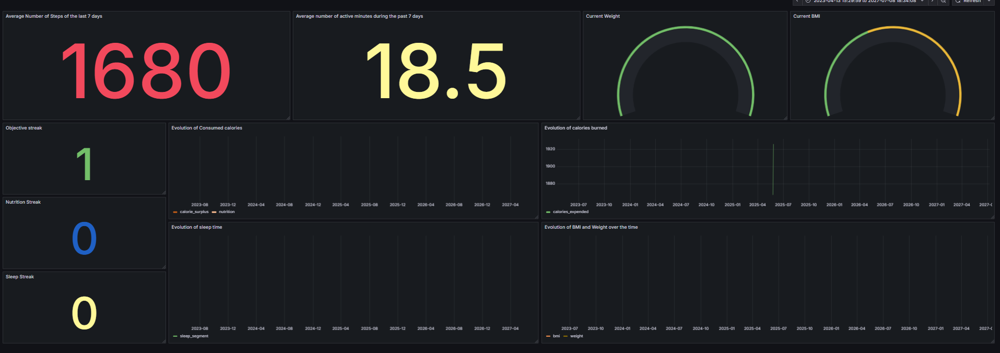

# 🏋️‍♂️ Fitness Health Monitor

**Too many skipped workouts and bad habits creeping in?**\
This project was born out of my personal need to get back on track. The **Fitness Health Monitor** is a data engineering project designed to automatically track and analyze personal health metrics such as:

- Sleep time
- Calories burned
- Steps walked
- Active minutes

The system fetches data from the **Google Fit API**, processes it, and visualizes it using **Grafana** with **alerts** for anomalies or missed goals.

---

## ⚙️ Project Architecture

This project uses a modern data stack:

- **Apache Airflow**: Orchestrates daily data workflows
- **Great Expectations**: Validates the quality of incoming data
- **Apache Spark**: Transforms and enriches raw data
- **PostgreSQL**: Stores the transformed health metrics
- **Grafana**: Visualizes health metrics and sends alerts
- **Github Actions**: Deploys auyomatically the new image upon changes

---

## ⏱️ Airflow DAG

The pipeline is scheduled to run **once a day** and contains four main steps:

1. **Fetch**: Pulls health data from the **Google Fit API**
2. **Validate**: Uses **Great Expectations** to ensure data quality
3. **Transform**: Applies Spark transformations and adds calculated metrics
4. **Store**: Saves clean data into **PostgreSQL** for visualization

---

## 🚀 Local Installation (with Docker)

The easiest way to run this project is using Docker.

### 1. Set up your `.env` file

Create a `.env` file in the root directory with the following content:

```env
# Airflow Configuration
AIRFLOW_UID=50000
AIRFLOW_IMAGE_NAME=apache/airflow:3.0.1
AIRFLOW_PROJ_DIR=.
_AIRFLOW_WWW_USER_USERNAME=admin
_AIRFLOW_WWW_USER_PASSWORD=admin

# Google Fitness API Credentials
GOOGLE_CLIENT_ID=
GOOGLE_CLIENT_SECRET=
GOOGLE_REFRESH_TOKEN=

# Grafana Email Alerting
GMAIL_SMTP_USER=
GMAIL_SMTP_PASSWORD=

# PostgreSQL
USER_POSTGRES_USER=postgres
USER_POSTGRES_PASSWORD=eded404
```

### 🔐 How to Get Google Fit API Credentials

To get your `GOOGLE_CLIENT_ID`, `GOOGLE_CLIENT_SECRET`, and `GOOGLE_REFRESH_TOKEN`:

1. Go to [Google Cloud Console](https://console.cloud.google.com/)
2. Create a new project
3. Enable the **Fitness API**
4. Set up OAuth 2.0 credentials and download the `client_secret.json`
5. Use tools like `oauth2l` or Postman to obtain your **refresh token**

---

### 2. Start the Services

Run the following commands to spin everything up:

```bash
docker-compose up airflow-init   # Initializes Airflow DB
docker-compose up -d             # Starts all services
```

- Access **Airflow**: [http://localhost:8080](http://localhost:8080) (login: `admin` / `admin`)
- Access **Grafana**: [http://localhost:3000](http://localhost:3000) (default login: `admin` / `admin`)

Once inside Airflow, trigger the `fitness_monitoring_dag` manually or wait for it to run on schedule.

---

## ☁️ Deploy to the Cloud

Running locally might not be optimal due to resource constraints. You’ll need:

- At least **2 CPU cores**
- **10 GB** of free disk space
- **6+ GB RAM** (especially for Spark)

To run in the cloud (e.g., on an **Azure VM**):

1. Clone this repository
2. Open bash at the base and make sure you have azure cli installed
3. Run the provisioning script:

```bash
./cloud.sh
```
This will define the VM , open the ports and gice you your PUBLIC_IP then :

4. Either:
   - Use `docker.sh` for a full setup
   - Or manually set `$AIRFLOW_HOME`, navigate to the `airflow/` folder and follow local Docker steps

Head over http:/<PUBLIC_IP>:8080 to access the AIrflow UI and http:/<PUBLIC_IP>:3000 to access the grafana UI

---

## 📊 Metrics & Alerts

Grafana dashboards show:

- Daily active time
- Sleep duration
- Step count and calories
- Weekly trends

Custom alerts can notify you via email (SMTP) when:
- Activity objective (more than 60min daily) drops below 3 days in the 7 last days
- Steps objective (more than 7000 steps ) drops below 3 days in the 7 last days
- Sleep hasn't been recorded for more than 3 days
- Calorie intake hasn't been recorded for more than 3 days
- Calorie intake objectives (2800kcal) streak drops below 3 days in the 7 last days


---



## 📦 CI/CD with GitHub Actions

This project uses **GitHub Actions** to deploy and restart Airflow automatically on every push to the `main` branch.

### ✅ Deployment Workflow

1. **SSH into Azure VM** using a private key from GitHub secrets
2. **Copy updated project files** including `.env` and `airflow_conns.json`
3. **Restart Docker containers** using `docker-compose down && docker-compose up -d`
4. **Verify deployment** using container health check (`docker ps`)

### 🔐 Required GitHub Secrets

| Secret Name              | Purpose                                 |
|--------------------------|-----------------------------------------|
| `VM_SSH_KEY`             | SSH private key for the Azure VM        |
| `GOOGLE_CLIENT_ID`       | Google Fit OAuth Client ID              |
| `GOOGLE_CLIENT_SECRET`   | Google Fit OAuth Client Secret          |
| `GOOGLE_REFRESH_TOKEN`   | Google Fit OAuth Refresh Token          |
| `GMAIL_SMTP_USER`        | SMTP Email used for Grafana alerts      |
| `GMAIL_SMTP_PASSWORD`    | Gmail App Password                      |
| `AIRFLOW_CONNS`          | JSON file of Airflow connections        |

---

## 🔔 Slack Alerts for Airflow Failures

When an Airflow task fails, a notification is automatically sent to a Slack channel using the `SlackAPIPostOperator`.


## 📁 Project Structure

```
├── dags/                   # Python DAG definition
   ├── fitness_api_etl/                   # Contains data fetchning a validation course
      ├── data/                   # Sample or fetched data
├── docker-compose.yml      # Docker configuration
├── cloud.sh                # Script to set up cloud VM
├── .env                    # Environment variables (not committed)
└── README.md               # You're here!
```

---

## 🛠️ Technologies Used

- Python
- Apache Airflow
- Apache Spark
- Great Expectations
- PostgreSQL
- Grafana
- Docker
- Github Actions

---

## 📬 Contact

Have questions or want to collaborate?

**Edgar Meva'a** – [mevaed4@mail.com](mailto:mevaed4@mail.com)

